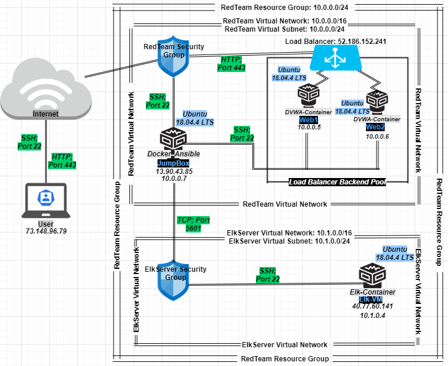
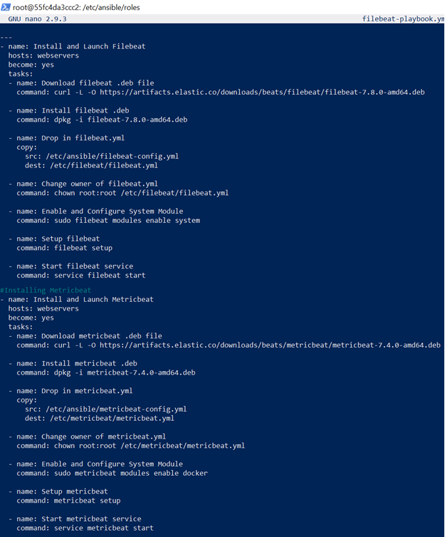
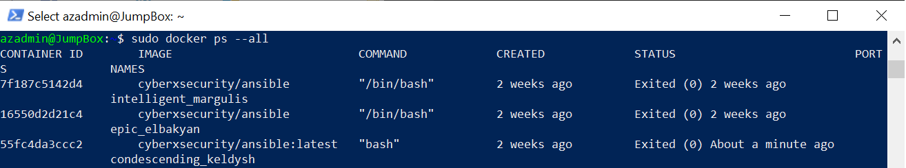
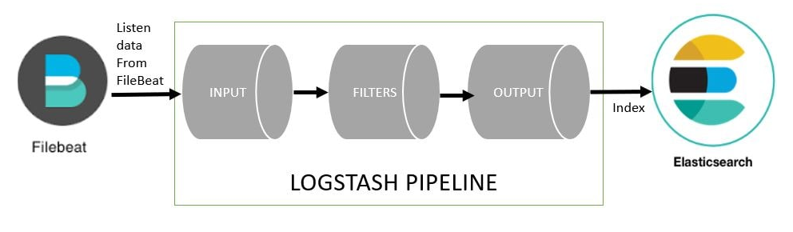
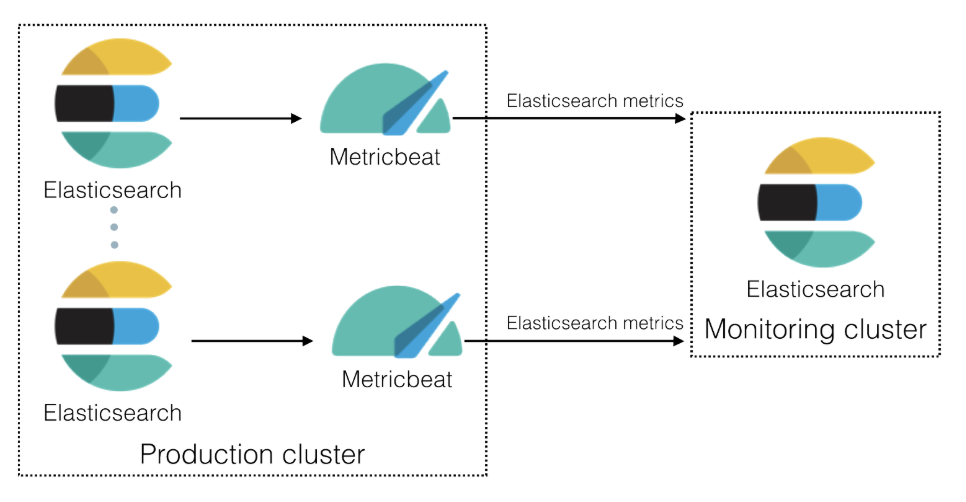
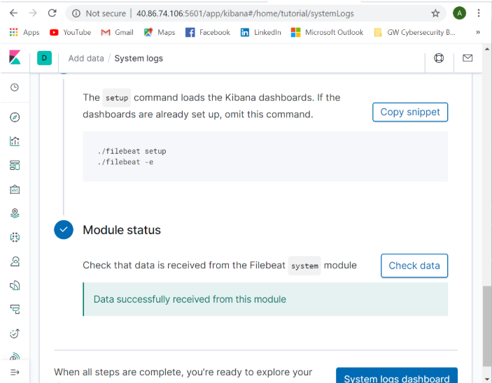

# **Automated ELK Stack Deployment**

The files in this repository were used to configure the network depicted below.

These files have been tested and used to generate a live ELK deployment on Azure. They can be used to either recreate the entire deployment pictured above. Alternatively, select portions of the filebeat-playbook.yml file may be used to install only certain pieces of it, such as Filebeat.

For updated Filebeat Playbook, refer to:

This document contains the following details:
- Description of the Topology
- Access Policies
- ELK Configuration
  - Beats in Use
  - Machines Being Monitored
- How to Use the Ansible Build

## **Description of the Topology**

The main purpose of this network is to expose a load-balanced and monitored instance of DVWA, the Damn Vulnerable Web Application.

Load balancing ensures that the application will be highly responsive, in addition to restricting and distributing traffic to the network. Futhermore, load balancers protect against DDoS attacks.

Advantages of utilizing a jump box:
  - Provides a secure computer that admins connect to before launching administrative tasks.
  - Provides an point to connect to other servers, providing more available RAM.
  - Allows for safely connecting to untrusted envirnoments.

Integrating an ELK server allows users to easily monitor the vulnerable VMs for changes to the designated servers, devices, and system applications.

Filebeat does the following:
  - Monitors log files or locations specified.
  - Collects log events.
  - Forwards collected data to Elasticsearch or Logstash for indexing.

Metricbeat periodically records collected metrics from the operating system (OS) and from services running on the server.

The configuration details are found below:

|          **Name**         	|                    **Function**                   	| **IP Address** 	|   **Operating System**   	|
|:-------------------------:	|:-------------------------------------------------:	|:--------------:	|:------------------------:	|
|   RedTeam Resource Group  	|           Controls & Organizes Resources          	|   10.0.0.0/24  	|             -            	|
|  RedTeam Virtual Network  	| Provides an Isolated & Highly-Secured Environment 	|   10.0.0.0/16  	|             -            	|
|   RedTeam Security Group  	|         Stateful Packet Filtering Firewall        	|        -       	|             -            	|
|          JumpBox          	|                      Gateway                      	|   13.90.43.85  	| Linux/Ubuntu 18.04.4 LTS 	|
|           Docker          	|        Allows for Deployment of Containers        	|        -       	|             -            	|
|          Ansible          	|       Allows for Defining of Security System      	|        -       	|             -            	|
|       Load Balancer       	|            Distributes Network Traffic            	| 52.186.152.241 	|             -            	|
|            Web1           	|       Vulnerable Server for Security Testing      	|    10.0.0.5    	| Linux/Ubuntu 18.04.4 LTS 	|
|            Web2           	|       Vulnerable Server for Security Testing      	|    10.0.0.6    	| Linux/Ubuntu 18.04.4 LTS 	|
| ElkServer Virtual Network 	| Provides an Isolated & Highly-Secured Environment 	|   10.1.0.0/16  	|             -            	|
|  ElkServer Security Group 	|         Stateful Packet Filtering Firewall        	|        -       	|             -            	|
|           Elk-VM          	|     Server Used to Monitor for Vulnerabilities    	|    10.1.0.4    	| Linux/Ubuntu 18.04.4 LTS 	|

## **Access Policies**

The machines on the internal network are not exposed to the public Internet. 

Only the JumpBox machine can accept connections from the Internet. Access to this machine is only allowed from the following IP addresses:
- 73.148.96.79

Machines within the network can only be accessed using SSH from JumpBox.
- 13.90.43.85

A summary of the access policies in place can be found in the table below:

| **Name** 	| **Publically Accessible** 	| **Allowed IP Addresses** 	|
|:--------:	|:-------------------------:	|:------------------------:	|
|  JumpBox 	|            Yes            	|       73.148.96.79       	|
|   Web1   	|             No            	|         10.0.0.7         	|
|   Web2   	|             No            	|         10.0.0.7         	|
|  Elk-VM  	|             No            	|         10.0.0.7         	|

## **Elk Configuration**

Ansible was used to automate configuration of the ELK machine. No configuration was performed manually, which is advantageous because it is more efficent and enables the user to rebuild them, should they want to reset it.

The playbook implements the following tasks:

0. Prerequisite: Elk Docker Conatining: Elastic Search, Kibana, Logstash.
1. Download image via Ansible-Playbook.
2. Create Filebeat-Playbook to download, install, enable, configure, setup, and start the filebeat service.

The following screenshot displays the result of running `docker ps --all` after successfully configuring the ELK instance.

## Target Machines & Beats
This ELK server is configured to monitor the following machines:
- 10.0.0.5
- 10.0.0.6

We have installed the following Beats on these machines:
- Filebeat
- Metricbeat

These Beats allow us to collect the following information from each machine.

Filebeat:
- Forwards and centralizes log data. It monitors specified log files or locations, collects log events, and forwards them to Elasticsearch or Logstash for indexing.

  

Metricbeat: 
- Periodically records collected metrics from the operating system (OS) and from services running on the server.

  

## Using the Playbook
In order to use the playbook, you will need to have an Ansible control node already configured. Assuming you have such a control node provisioned: 

SSH into the control node and follow the steps below:
- Copy the Filebeat configuration file to /etc/ansible/files/filebeat-configuration.yml.
  - Note: To minimize errors, use `curl`, followed by the configuration file's URL to obtain the Filebeat configuration file. Run: 

    `curl https://gist.githubusercontent.com/slape/5cc350109583af6cbe577bbcc0710c93/raw/eca603b72586fbe148c11f9c87bf96a63cb25760/Filebeat > /etc/ansible/files/filebeat-config.yml`

- Update the Filebeat configuration file to include:
  - ELK server's IP address (10.1.0.4).

- Run the playbook, using:

  - `ansible-playbook filebeat-playbook.yml`

- Navigate to Kibana to check the Module Status and that the installation worked as expected. It should look like:

  

